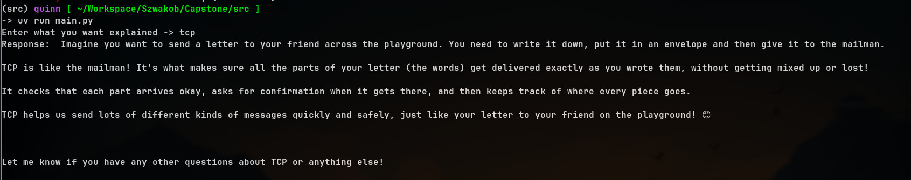

---
# Table of Contents
1. [Running Ollama Through Docker](#running-ollama-through-docker)
2. [Interacting With Ollama through LangChain](#interacting-with-ollama-through-langchain)
3. [Working Example](#working-example)
4.  [Problems](#problems) 

---

## Running Ollama Through Docker

Using the Docker Image on DockerHub, I created a containerized environment to run ollama and natural language machine learning models locally to be used within LangChain. As of right now, we I am only focusing on using CPU to generate tokens, we can work on GPU Acceleration later.

1. DockerHub Image ->  [image](https://hub.docker.com/r/ollama/ollama)
2. Ollama Model -> [gemma2b](https://ollama.com/library/gemma:2b)

More specifically, I chose gemma2b as a lightweight model for fast testing but mostly coherent responses.

---

## Interacting with Ollama through LangChain

Example provided by LangChain:

```
from langchain_core.prompts import ChatPromptTemplate  
from langchain_ollama.llms import OllamaLLM  
  
template = """Question: {question}  
  
Answer: Let's think step by step."""  
  
prompt = ChatPromptTemplate.from_template(template)  
  
model = OllamaLLM(model="llama3.1")  
  
chain = prompt | model  
  
chain.invoke({"question": "What is LangChain?"})
```

My example:

```
from langchain_ollama import OllamaLLM
from langchain_core.prompts import ChatPromptTemplate


def main():
    model = OllamaLLM(model="gemma2:2b", base_url="http://localhost:11434")

    template = "Explain this like I am 5 years old: {text}"
    prompt = ChatPromptTemplate.from_template(template)

    chain = prompt | model

    explain_item = input("Enter what you want explained -> ")

    result = chain.invoke({"text": explain_item})
    print("Response: ", result)


if __name__ == "__main__":
    main()
```

---
## Working Example

This is an instance of it working (may have to open image in new tab):



---
## Problems

Some of the problems that I encounters was that when running Ollama through Docker, the models installed will be removed after the deletion of the container. A solution to this is to install ollama locally, and install all the models locally and mount the model directory to the docker container to avoid downloads and deletions.
Some of the problems that I encounters was that when running Ollama through Docker, the models installed will be removed after the deletion of the container. A solution to this is to install ollama locally, and install all the models locally and mount the model directory to the docker container to avoid downloads and deletions.