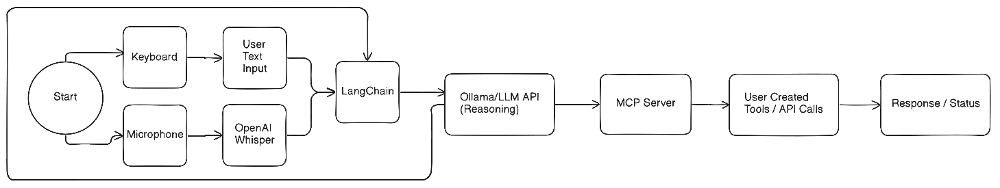

---
# Table of Contents
1. [New Updated Architecture](#new_updated_architecture)
2. [Purpose](#purpose)
3. [MCP Server Implementation](#mcp_server_implementation)
4. [Benefits of MCP Architecture](#benefits_of_mcp_architecture)
5. [Integration Flow](#integration_flow)

---
## New Updated Architecture

After some deliberation, the addition of a MCP server (Model Context Protocol) was an obvious implementation. The new architecture wire-frame is below.



---
## Purpose

The addition of a model context protocol allows safe tool calling with validation, along with a convenient abstraction layer that simplifies the main server than handles the user interface.

---
## MCP Server Implementation

The MCP server is built in Go and serves as a dedicated tool execution service. It exposes a single HTTP endpoint at `/tool` that accepts JSON-formatted tool calls and returns structured responses.

### Core Architecture

The server follows a clean modular design:

- **server.go**: HTTP server handling incoming requests
- **tools.go**: Tool routing and validation logic  
- **Individual tool files**: Specific implementations (weight_logger.go, weather.go, mongo_wrapper.go)

### Request/Response Format

All tool calls follow a standardized JSON structure:

```json
{
  "tool": "weight_logger",
  "action": "log",
  "parameters": {"weight": 180.0}
}
```

This consistent format allows the AI system to generate tool calls programmatically while ensuring type safety and proper validation.

---
## Benefits of MCP Architecture

### Separation of Concerns

The MCP server creates clear boundaries between:
- AI processing (Python/LangChain)
- Tool execution (Go/MCP server)
- Data persistence (MongoDB)

### Enhanced Security

All tool inputs are validated before execution:
- Parameter type checking
- Range validation for numeric inputs
- Structured error handling

### Extensibility

Adding new tools follows a consistent pattern:
1. Create tool implementation file
2. Add validation logic
3. Register in the tool router
4. Update AI system prompt

This makes the system easily expandable for future capabilities.

---
## Integration Flow

The complete request flow demonstrates the architecture's elegance:

1. User input → Python Flask server
2. LangChain processes input with Ollama LLM
3. AI generates JSON tool call if needed
4. HTTP POST to MCP server
5. Tool execution with validation
6. Response returned to AI server
7. Formatted output presented to user

This flow ensures each component handles its specialized task while maintaining clean interfaces between services.